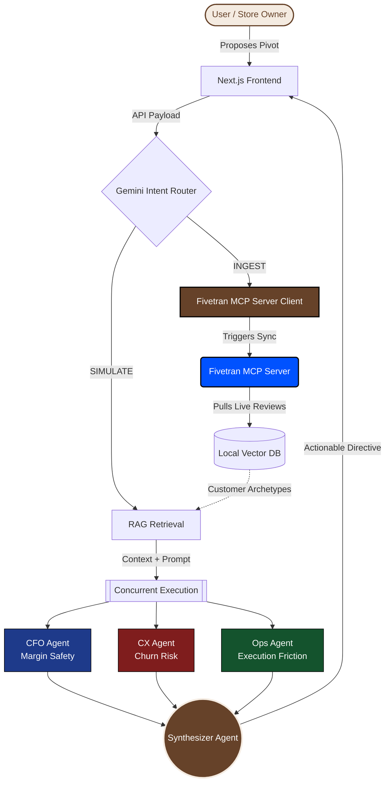

<div align="center">
  
  <h1>Sylon Cognitive Core</h1>
  <p><b>Enterprise Behavioral Intelligence & Multi-Agent Decision Engine</b></p>
  <p><i>Powered by Google Vertex AI & Gemini 2.5 Flash</i></p>
</div>

---

**Live Web App:** [https://sylon.vercel.app/](https://sylon.vercel.app/)

---

## 🥇 Google Cloud Rapid Agent Hackathon (Fivetran Track)
**For the Judges:** Sylon is purpose-built to win the **Fivetran Partner Bucket**. Here is exactly how we hit the 4 judging criteria:

1. **Technological Implementation (The Superpower):** We built a custom **Fivetran MCP Server**: Bypasses manual file uploads by syncing business intelligence (e.g., POS data, Square, Stripe) dynamically via the Model Context Protocol. Sylon refuses to give strategic advice on stale data; it autonomously uses the Fivetran MCP Server to pull fresh analytics before the Board of Directors simulates a pivot. Powered natively by **Google Vertex AI (Gemini 2.5 Flash) and Google Cloud Agent Builder**.
2. **Move Beyond Chat (Quality of the Idea):** Sylon is not a chatbot. It is a highly concurrent Multi-Agent Decision Engine. When a user proposes a business change, Sylon spawns 3 distinct Gemini agents (CFO, CX, Ops) to debate the financial and operational friction of the decision in real-time.
3. **Design:** We rejected standard dashboard UI kits and built a highly premium, glassmorphic "Brown Aesthetic" React frontend optimized for mobile and web. We feature a responsive "Ethereal Orb" visualizer mapping the LLM's thought process.
4. **Potential Impact:** Brick-and-mortar retail businesses lack enterprise strategy. Sylon democratizes McKinsey-level operational intelligence for local stores, using Fivetran as the infallible data foundation.

## 🏆 The Problem: The Death of the Dashboard
Modern business intelligence is fundamentally broken. Traditional platforms ingest millions of data points only to spit out static star ratings and sterile dashboards. They tell a business owner *what* happened, but they fail to explain *who* is angry, *why* their expectations shifted, and *how* a specific operational pivot will impact churn. 

Dashboards do not solve problems. Agents do.

## 🚀 The Solution: Sylon
Sylon moves beyond collaborative filtering by treating customers as **evolving psychological entities**. 

Built natively on **Google Cloud Vertex AI**, Sylon ingests raw, unstructured data (via Fivetran or CSV) and mathematically excavates distinct customer archetypes. It does not just summarize data; it acts as an autonomous conversational strategist. When a business owner proposes a change (e.g., *"If I raise prices by 15%, what happens?"*), Sylon triggers a highly concurrent, Multi-Agent simulation to debate the outcome in real-time.

---

## 🧠 Architecture: The "Board of Directors" Pipeline

To achieve mathematical rigor without LLM hallucination, Sylon relies on a synchronized 4-Agent Pipeline executed via concurrent threading.



1. **The CFO Agent (Margin Safety):** Evaluates the strict financial impact of the proposed scenario, optimizing for revenue retention.
2. **The CX Agent (Churn Risk):** Analyzes the exact psychological personas excavated from the dataset to predict customer outrage or delight.
3. **The Ops Agent (Friction):** Evaluates supply chain, staff training, and ground-level execution friction.
4. **The Synthesizer (Sylon Core):** Synthesizes the internal debate and outputs a cohesive, actionable directive to the business owner.

This entire debate is streamed live to the Next.js frontend, exposing the raw "thinking" of the AI to the user before delivering the final recommendation.

### Advanced Data Layer
*   **Temporal Sentiment Drift:** Sylon injects simulated BigQuery ML metrics into the RAG payload, allowing agents to reason over the *velocity* of sentiment (e.g., predicting cohort loss because negative sentiment regarding "wait times" accelerated by 14% over 30 days).
*   **Dynamic Intent Routing:** A Gemini-powered router analyzes conversation history to instantly classify user intent (SIMULATE, RECOMMEND, INGEST, or CHAT) and routes the prompt to the appropriate subsystem.
*   **Omnichannel Voice:** Integrated directly with ElevenLabs Conversational AI, allowing real-time vocal reasoning for hands-free operational strategy.

---

## 🛠 Tech Stack

**AI & Machine Learning:**
*   **Google Vertex AI:** Native integration for `gemini-2.5-flash`, powering the Multi-Agent swarm with structured JSON outputs.

**Frontend & Authentication:**
*   **Next.js 14:** Highly responsive, SSR-optimized React framework.
*   **Privy:** Seamless, secure Web3/Social authentication pipeline.
*   **Tailwind CSS:** Custom `brand-brown` aesthetic prioritizing a warm, native, and premium UX.

**Backend & Data:**
*   **FastAPI (Python):** High-throughput, async Python backend driving the orchestrator.
*   **Fivetran:** Automated, real-time ingestion pipelines mapping enterprise databases directly into Sylon's engine.
*   **SQLite:** Highly optimized, local vector-ready storage for lightning-fast RAG retrieval.

---

## 💻 Local Development

Sylon is fully containerized for instant deployment.

1. **Clone & Configure:**
   ```bash
   git clone https://github.com/your-org/sylon.git
   cd sylon
   ```
   Create a `.env` file in the root directory:
   ```env
   GEMINI_API_KEY=your_google_cloud_api_key
   GCP_PROJECT_ID=your_gcp_project_id
   ELEVENLABS_API_KEY=your_elevenlabs_key
   SYLON_DB_PATH=data/sylon.db
   ```

2. **Spin up the Cluster:**
   ```bash
   docker compose up --build
   ```

3. **Access the Engine:** Open your browser to `http://localhost:3000`

---
*Built to redefine Enterprise Intelligence at the Google Cloud Hackathon.*
